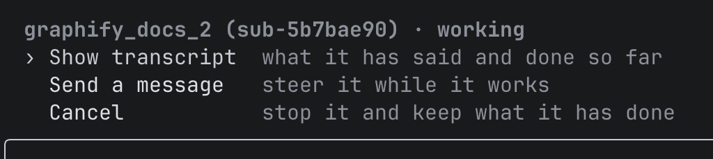

[X] read agents.md or sirus.md
[X] quitting mid response saves whats happened up to that point.
  [X] fixes state of command list header

[X] changing model in one session doesn't change the model in all sessions even for sirus
[X] create proper readme and then also update website
[X] esc should only cancel current session
[X] active subagent should be per session.

[X] skills
[X] heartbeat mechanism
[X] when turn was cancelled, all tools should fial. "running commands" should also stop

[]  nvm i alr did. right now  this is what we see when i press enter on a rnuning subagent. however, it should isntead mimic claude where it doesn't add that extra step. it has an actual UI that shows the transcript and also lets me send a message
[] Pasting an image should use the normal paste command. It shouldn't be any different and it should also not show an info line where it says image added. The one with the tick. I don't know what it's called
[] Steer messages should appear where they were injected. So right now they always appear after the agent's full message, even if the agent read it halfway through their message
[] pressing ctrl c shouldn't display the "ctrl c again to exit text" that is already implied.
[] session managing menu is shit. it should be "search: ____________" or a search bar box, so it's aesthetic, and the underline should be dimmed. the distinction between manage and non manage should be non manage doesn't display the x on hover. once we are in manage mode, it then does, so we can remove the hint for "^d delete". to rename, double click on a session will allow us to rename it in place and enter confirms the name (we don't have to specify these commands). thus we can remove the "^r rename" hint too. the only extra hints in manage mode should be "^a archive" and "esc back". also the delete confirmation should again be inline and the x button is replaced with y/n clicking on y goes ahead with the delete.
