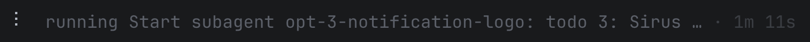

### optimisations
[x] the loading animation bar in the top right over the name of the agent should be 4 hight not 3, so it takes up full height of the pill.

[x] tools & running command headers should be collapsed by default, and only expand when clicked.

[x] notifications should come with the sirus logo

[x] highlighting input bar only highlights within the input bar.

[x] remove the 5h from codex in the usage menu since codex doesn't have a 5h limit.

[x] skills/commands can be run in the middle of a prompt too not just at the start.

[x] when a message is addressed to a given agent, it should automatically navigate to that agent's session. if a message tags multiple agents, it should navigate to the first agent's session and display all the other agent's messages in that session too for that turn (as in through the current method where it appears both in their session but also in the selected session if u get what i mean, this is a convenience/UX addition not a structural change). note that a tag being NOT the first thing indicates the first agent being "tagged" (not really, but in terms of the user's intent) is sirus. so it shuld stay in sirus in that case. 

[x] @name model thinking should be allowed from anywhere in a prompt. also, in a prompt, suppose i do /model opus [prompt] it should apply the /model. it should also work with /model [model] [thinking mode] prompt. as in all commands should work like that.

[x] loading animation bar over the name should start at the beginning of the pill not the text, and go to the end of the pill not the text.

[x] when a session/task needs you the ! is enough it doesn't need the "needs" text

[x] sees like changing thinking mode results in a persistent "changed to [thinking mode]" message. these messages should automatically clear after a couple seconds. 

[x]  rn it includes the "Start" text but that comes off as awkward. genralise this issue and fix it.

[x]  in "↑ edit queued · ctrl+enter sends now" remove "edit queued" and "sends now" text.

[x] session with subagent running should have the active animation in the sidebar and the header pill 

## features
[] auto-rag + breadcrumb memory system (copy from ../sirius)
[] agent preconfigurations

[] /rc without Tailscale installed should offer the fix right there (`brew install --cask tailscale`, or a link that opens tailscale.com/download) instead of only saying it's missing.

[] the iOS app's setup screen should explain a failed connection (Tailscale not running on the phone or the Mac) and link straight to Tailscale in the App Store.

[] each session should be owned by a sirus instance so i can't modify a session in two diff sirus isntances (e.g. terminal windows)

## ios
[] should be able to change permission mode, thinking mode, model by clicking on the info underneath the message bar
